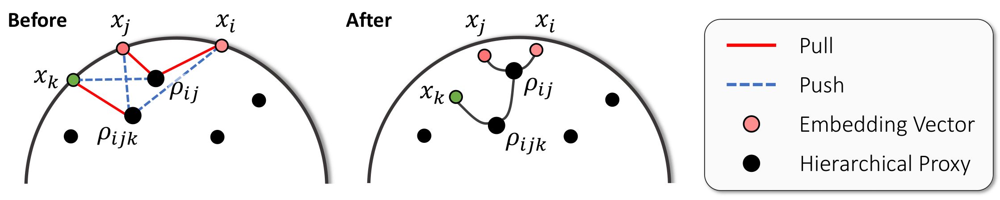
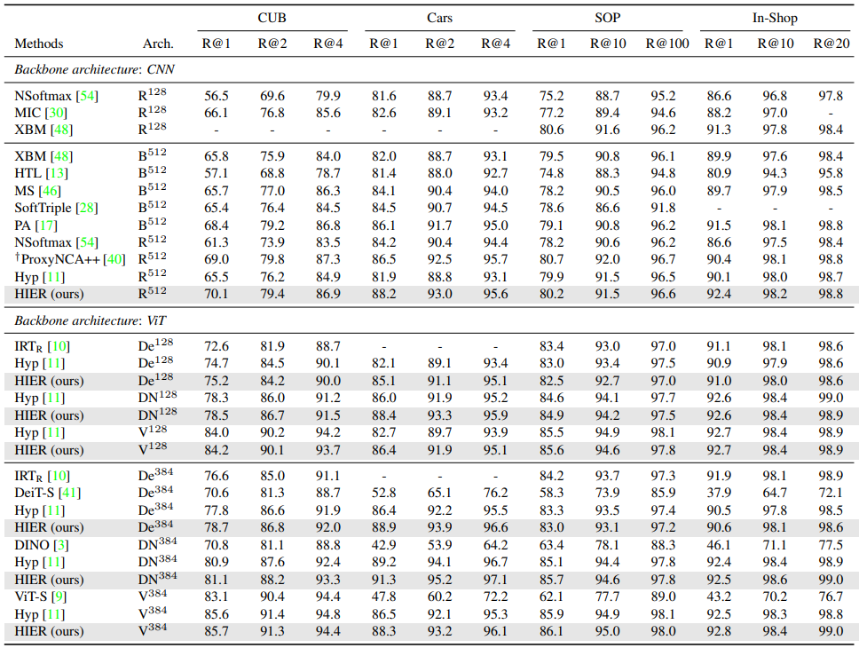

# HIER: Metric Learning Beyond Class Labels <br> via Hierarchical Regularization (CVPR 2023)

<div align="left">
  <h4> <a href=https://cvlab.postech.ac.kr/~sungyeon>Sungyeon Kim</a>, <a href=https://scholar.google.com/citations?user=CiQLGVMAAAAJ&hl>Boseung Jeong</a>, <a href=https://suhakwak.github.io/>Suha Kwak</a> </h4>
</div>

<div align="left">
  <h4> <a href=https://arxiv.org/abs/2212.14258>[paper]</a>, <a href=http://cvlab.postech.ac.kr/research/HIER>[project hompage]</a></h4>
</div>

<br>

This repository contains the official PyTorch implementation of the paper **HIER: Metric Learning Beyond Class Labels via Hierarchical Regularization**, which is published in CVPR 2023.
Our proposed approach, called HIER, is a new regularization method for metric learning. It aims to discover the latent semantic hierarchy of training data and deploy the hierarchy to provide richer and more fine-grained supervision than inter-class separability induced by common metric learning losses.

## Overview

### What is HIER
A conceptual illustration of the learning objective in HIER loss. Each hierarchical proxy is colored in black and different colors
indicate different classes. The associations defined by the losses are expressed by edges, where the red solid line means the pulling and the
blue dotted line is the pushing. Relevant pairs are pulled into their LCA, and the remaining sample is pulled into LCA of the entire triplet.
  
<p align="center"></p>

### What HIER does

<p align="center"></p>
A tree-like hierarchical structure between data and hierarchical proxies is constructed in
the embedding space learned by HIER. The middle figures
are enlarged figures of part of the embedding space, which
shows that samples in a sub-tree share common semantics,
although not of the same class. This visualization proves
that HIER discovers and deploys latent and meaningful hierarchies between data in the embedding space.

See [this example](./examples/umap_vis_cars.ipynb) for how to produce these visualizations. 

### Experimental Results
<p align="center"></p>

## Installation
See [INSTALL.md](INSTALL.md) for installation details.

## Datasets
1. Download four public benchmarks for deep metric learning
   - [CUB-200-2011](http://www.vision.caltech.edu/visipedia-data/CUB-200-2011/CUB_200_2011.tgz)
   - Cars-196 ([Img](http://imagenet.stanford.edu/internal/car196/car_ims.tgz), [Annotation](http://imagenet.stanford.edu/internal/car196/cars_annos.mat))
   - Stanford Online Products ([Link](https://cvgl.stanford.edu/projects/lifted_struct/))
   - In-shop Clothes Retrieval ([Link](http://mmlab.ie.cuhk.edu.hk/projects/DeepFashion.html))

2. Extract the tgz or zip file into `./data/` (Exceptionally, for Cars-196, put the files in a `./data/cars196`)

## Training Embedding Network

Train embedding model with Proxy-Anchor loss and HIER on a single node with 4 gpus for 100 epochs run:

```bash
python -m torch.distributed.launch \
    --master_port=${MASTER_PORT:-$RANDOM} \
    --nproc_per_node=4 train.py \
    --data_path /path/to/dataset \
    --lr {1e-4 1e-5} \
    --num_hproxies 512 \
    --weight_decay {1e-2 1e-4} \
    --lambda1 1 --lambda2 {0.5 1} \
    --dataset {CUB Cars SOP Inshop} \
    --model {resnet50 deit_small_distilled_patch16_224 vit_small_patch16_224 dino_vits16} \
    --IPC {0 2} --loss {MS PA} \
    --emb {128 384 512} \ 
    --bn_freeze True 
```
For details, see [scripts](scripts) folder. 

We also support training embedding model with <a href=https://github.com/htdt/hyp_metric>Hyp</a>:

```bash
python -m torch.distributed.launch \
    --master_port=${MASTER_PORT:-$RANDOM} \
    --nproc_per_node=4 train.py \
    --data_path /path/to/dataset \
    --lr {1e-4 1e-5} \
    --num_hproxies 512 \
    --weight_decay {1e-2 1e-4} \
    --lambda1 1 --lambda2 0 \
    --dataset {CUB Cars SOP Inshop} \
    --model {resnet50 deit_small_distilled_patch16_224 vit_small_patch16_224 dino_vits16} \
    --IPC 8 --loss SupCon \
    --emb {128 384 512} \ 
    --bn_freeze True 
```

## Acknowledgements

Our source code is modified and adapted on these great repositories:

- [Hyperbolic Vision Transformers: Combining Improvements in Metric Learning](https://github.com/htdt/hyp_metric)
- [Proxy Anchor Loss for Deep Metric Learning](https://github.com/tjddus9597/Proxy-Anchor-CVPR2020)
- [PyTorch Metric learning](https://github.com/KevinMusgrave/pytorch-metric-learning)


## Citation

If you use this method or this code in your research, please cite as:

    @inproceedings{kim2023hier,
      title={HIER: Metric Learning Beyond Class Labels via Hierarchical Regularization},
      author={Kim, Sungyeon and Jeong, Boseung and Kwak, Suha},
      booktitle={Proceedings of the IEEE Conference on Computer Vision and Pattern Recognition},
      year={2023}
    }